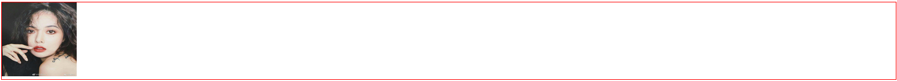

## CSS/code下文件说明：

### 01-a标签的伪类选择器.html

```html
 <div class="btn-div">
      <button>show menu</button>
      <!-- 小tip:将显示的元素放于触发的元素内部,解决因从button上移开，list消失的问题 -->
      <div class="list-div">
        <ul>
          <li>HTML</li>
          <li>CSS</li>
          <li>JavaScript</li>
          <li>Node</li>
        </ul>
      </div>
    </div>
```
```css
.list-div {
      display: none;
    }
.btn-div:hover > .list-div {
      display: block;
    }
```
### 02-属性选择器.html

### 03-伪元素选择器.html

### 04-伪类选择器-元素相关.html

```css
box-shadow: 3px 3px 3px coral;/* 盒子阴影：x正方向自左向右 y正方向自上向下 模糊距离*/
outline: 1px solid red; /*外线，不占据屏幕空间*/
```
### 05-伪类-子元素相关.html

- 表格中设置宽高，给行tr设置高，给列td，th设置宽

```css
border-collapse: collapse;/*表格边框合并，==原先的cellspacing=0*/
/*实现表格隔行变色*/
tbody>tr:nth-child(even){
  background-color: #ccc;
}
```

### 06-文本样式.html

### 07-利用border画三角形.html

对文本内容溢出的处理，和使用border绘制三角形和箭头的实践

### 08-animation.html

动画的定义及相关属性的使用

---
### 两列布局

```html
<style>
        *{
            margin: 0;
            padding: 0;
        }
        .container{
            display: flex;
            height: 300px;/*固定高度*/
            /*去掉height设置以下四行代码  高度可占满*/
/* 浮动或者定位过的元素，宽度将不再是100%，而是由内部内容撑起来，如果希望保持原来的宽度需手动设置 */
           /* position: absolute;
            top: 0;
            bottom: 0;
            width:100%;*/
        }
    .left-div{
        width:200px;
        background-color: coral;
    }
    .right-div{
        width: calc(100% - 200px);
        background-color: teal;
    }
</style>

<body>
    <div class="container">
        <div class="left-div"></div>
        <div class="right-div"></div>
    </div>
</body>
```

09-float-position.html  

- 浮动和定位对块级元素产生的影响--会使块级元素的宽度将不再是100%，而是由内部内容撑起来

- 清除浮动 --确切的来说应该是清除别人浮动对自己产生的影响
  - 清除兄弟对我产生的影响 ，我给自己设置clear：both；让我还在原来的位置。
  - 清除子元素对我产生的影响，我给自己设置overflow：hidden；让我的高度仍然保持。
- 当有一个div，position：fixed；（脱离文档流，飘在另一层）永远固定在顶部或底部，可能会使一些文本看不见，这个时候可以通过给body设置padding-top或padding-bottom大于或等于可见文本的高度即可看得见。

### 10-position.html

对relative absolute，fixed定位方式的实践，注意关注是否脱离文档流，以及如何定位。

---

### 图片底部间隙问题



```html
<style>
      img {
        width: 100px;
        height: 100px;
        /* display:  block;解决底部空隙 */
      }
      div {
        border: 1px solid red;
        /* font-size: 0;效果同上display */
      }
</style>

  <body>
    <div>
      
    </div>
  </body>
```

### 两个滚轮的实现

```html
<!DOCTYPE html>
<html lang="en">
<head>
    <meta charset="UTF-8">
    <meta name="viewport" content="width=device-width, initial-scale=1.0">
    <meta http-equiv="X-UA-Compatible" content="ie=edge">
    <title>滚轮</title>
    <style>
        /*一边移动一边转圈*/
    div{
        width:100px;
        height:100px;
        background: teal;
        border-radius: 50%;
        animation: myani 2s infinite alternate;
        display: inline-block;
    }
    @keyframes myani{
        0%{
            transform: translate(0) rotate(0deg);
        }
        100%{
            transform: translateX(400px) rotate(360deg);
            background: chocolate;
        }
    }
    @media screen and (min-width:1200px){
        div{
            background: red;
        }
    }
    @media screen and (min-width:768px) and (max-width:992px){
        div{
            background: blue;
        }
    }
    </style>
</head>
<body>
    <div>圆圈</div>
    <div>gungun</div>
</body>
</html>
```

### 11-transform.html

对一些transform属性的实践  --旋转，缩放，平移

