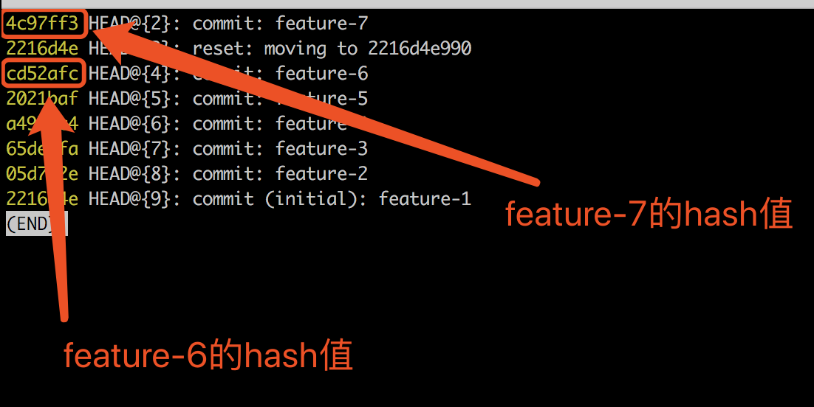

发现问题，解决问题 总结问题

## 1、块级和行内元素

块级 div p h1-h6 ul li
行内元素 span a i em strong

## 2、CSS hack 技巧

什么是？--为了统一页面效果在各大浏览器及版本而写的特定的 css 样式 code，这个过程就叫 css hack

由于不同厂商的浏览器或某浏览器的不同版本，对 CSS 的支持、解析不一样，导致在不同浏览器的环境中呈现出不一致的页面展现效果。这时，我们为了获得统一的页面效果，就需要针对不同的浏览器或不同版本写特定的 CSS 样式，我们把这个针对不同的浏览器/不同版本写相应的 CSS code 的过程，叫做 CSS hack!

> （如 IE6-IE11,Firefox/Safari/Opera/Chrome 等）

分类？

- CSS 属性前缀法(即类内部 Hack):在 CSS 样式属性名前加上一些只有特定浏览器才能识别的 hack 前缀，以达到预期的页面展现效果
  > hack 前缀 :\* + - # \0 \9\0 important
- 选择器前缀法(即选择器 Hack):在 CSS 选择器前加上一些只有某些特定浏览器才能识别的前缀进行 hack。
- IE 条件注释法(即 HTML 条件注释 Hack)，
  > 实际项目中 CSS Hack 大部分是针对 IE 浏览器不同版本之间的表现差异而引入的。

一般情况下，我们尽量避免使用 CSS hack，但是有些情况为了顾及用户体验实现向下兼容，不得已才使用 hack。

给属性加浏览器内核前缀

## 3、如何劫持 https 的请求，提供思路

https 是为了解决 http 明文传输不安全而产生的，但尽管 https 比 http 更安全，也不是绝对的安全

以下提供一个本地劫持 https 请求的简单思路

模拟中间人攻击，以百度为例

    先用OpenSSL查看下证书，直接调用openssl库识别目标服务器支持的SSL/TLS cipher suite

openssl s_client -connect www.baidu.com:443

    用sslcan识别ssl配置错误，过期协议，过时cipher suite和hash算法

sslscan -tlsall www.baidu.com:443

    分析证书详细数据

sslscan -show-certificate --no-ciphersuites www.baidu.com:443

    生成一个证书

openssl req -new -x509 -days 1096 -key ca.key -out ca.crt

    开启路由功能

sysctl -w net.ipv4.ip_forward=1

    写转发规则，将80、443端口进行转发给8080和8443端口

    iptables -t nat -A PREROUTING -p tcp --dport 80 -j REDIRECT --to-ports 8080
    iptables -t nat -A PREROUTING -p tcp --dport 443 -j REDIRECT --to-ports 8443

    最后使用arpspoof进行arp欺骗

## 4、前端如何进行 seo 优化

- 合理的 title、description、keywords：搜索对着三项的权重逐个减小，title 值强调重点即可；description 把页面内容高度概括，不可过分堆砌关键词；keywords 列举出重要关键词。
- 语义化的 HTML 代码，符合 W3C 规范：语义化代码让搜索引擎容易理解网页
- 重要内容 HTML 代码放在最前：搜索引擎抓取 HTML 顺序是从上到下，保证重要内容一定会被抓取
- 重要内容不要用 js 输出：爬虫不会执行 js 获取内容；少用 iframe：搜索引擎不会抓取 iframe 中的内容
- 非装饰性图片必须加 alt
- 提高网站速度：网站速度是搜索引擎排序的一个重要指标

## 5、前后端分离的项目如何 seo

- 使用 prerender。但是回答 prerender，面试官肯定会问你，如果不用 prerender，让你直接去实现，好的，请看下面的第二个答案。
  > ，Prerender 是一个采用 phantomjs 的服务，它是可以对 JavaScript 页面进行静态化
- 先去 https://www.baidu.com/robots.txt 找出常见的爬虫，然后在 nginx 上判断来访问页面用户的 User-Agent 是否是爬虫，如果是爬虫，就用 nginx 反向代理到我们自己用 nodejs + puppeteer 实现的爬虫服务器上，然后用你的爬虫服务器爬自己的前后端分离的前端项目页面，增加扒页面的接收延时，保证异步渲染的接口数据返回，最后得到了页面的数据，返还给来访问的爬虫即可。

## 6、简单实现 async/await 中的 async 函数

实现原理，就是将 Generator 函数和自动执行器，包装在一个函数里

```js
function spawn(genF) {
  return new Promise(function(resolve, reject) {
    const gen = genF();
    function step(nextF) {
      let next;
      try {
        next = nextF();
      } catch (e) {
        return reject(e);
      }
      if (next.done) {
        return resolve(next.value);
      }
      Promise.resolve(next.value).then(
        function(v) {
          step(function() {
            return gen.next(v);
          });
        },
        function(e) {
          step(function() {
            return gen.throw(e);
          });
        }
      );
    }
    step(function() {
      return gen.next(undefined);
    });
  });
}
```

## 7、1000-div 问题

一次性插入 1000 个 div，如何优化插入的性能 - 使用 Fragment

```js
var fragment = document.createDocumentFragment();
fragment.appendChild(elem);
```

向 1000 个并排的 div 元素中，插入一个平级的 div 元素，如何优化插入的性能 - 先 display:none 然后插入 再 display:block - 赋予 key，然后使用 virtual-dom，先 render，然后 diff，最后 patch - 脱离文档流，用 GPU 去渲染，开启硬件加速

## 8、如何在浏览器端中进行大数据的存储优化和检索优化

开放题:2 万小球问题：在浏览器端，用 js 存储 2 万个小球的信息，包含小球的大小，位置，颜色等，如何做到对这 2 万条小球信息进行最优检索和存储

> 如果你仅仅只是答用数组对象存储了 2 万个小球信息，然后用 for 循环去遍历进行索引，那是远远不够的,这题要往深一点走，用特殊的数据结构和算法进行存储和索引。然后进行存储和速度的一个权衡和对比，最终给出你认为的最优解

我提供几个能触及阿里 p7 和腾讯 t31 级别的思路：

- 用 ArrayBuffer 实现极致存储
- 哈夫曼编码 + 字典查询树实现更优索引
- 用 bit-map 实现大数据筛查
- 用 hash 索引实现简单快捷的检索
- 用 IndexedDB 实现动态存储扩充浏览器端虚拟容量
- 用 iframe 的漏洞实现浏览器端 localStorage 无限存储，实现 2 千万小球信息存储

## 9、对大数据的动画显示优化

开放题:接上一题如何尽可能流畅的实现这 2 万小球在浏览器中，以直线运动的动效显示出来

当然方法有很多种。

但是你有没有用到浏览器的高级 api？

你还有没有用到浏览器的专门针对动画的引擎？

或者你对 3D 的实践和优化，都可以给面试官展示出来

提供几个思路：

- 使用 GPU 硬件加速
- 使用 webGL
- 使用 assembly 辅助计算，然后在浏览器端控制动画帧频
- 用 web worker 实现 javascript 多线程，分块处理小球
- 用单链表树算法和携程机制，实现任务动态分割和任务暂停、恢复、回滚，动态渲染和处理小球

## 10、考察算法和实际问题结合

开放题 100 亿排序问题：内存不足，一次只允许你装载和操作 1 亿条数据，如何对 100 亿条数据进行排序

> 以前老听说很多人问，前端学算法没有用，考算法都是垃圾，面不出候选人的能力

其实，当你在做前端需要用到 crc32、并查集、字典树、哈夫曼编码、LZ77 之类东西的时候
已经是涉及到框架实现和极致优化层面了,那时你就已经到了另外一个前端高阶境界了

==所以不要抵触算法，可能只是我们目前的眼界和能力，还没触及到那个层级==

## 11、a.b.c.d 和 a'b'['d']，哪个性能更高

> 别看这题，题目上每个字都能看懂，但是里面涉及到的知识，暗藏杀鸡

这题要往深处走，会涉及 ast 抽象语法树、编译原理、v8 内核对原生 js 实现问题

简单来讲，基本无差异，dot 可能好点，但是这点性能可以忽略

## 12、git 时光机问题

> 很多面试候选人对 git 只会 commit、pull、push

但是有没有使用过== reflog、cherry-pick ==等等，这些都很能体现出来你对代码管理的灵活程度和代码质量管理。

基本上掌握了 git reflog 和 git cherry-pick，你的 git 命令行操作就算是成功入门了

场景：公司新来了一个前端小白，她对 git 不熟悉，辛辛苦苦加班一星期 翘的代码没了
怎么弄没的呢？

1、在终端输入 git log，列出所有的 commit 信息，commit 的信息很简单，就是做了 6 个功能，每个功能对应一个 commit 的提交，分别是 feature-1 到 feature-6

2、然后前端小白坑爹了，执行了强制回滚`git reset --hard 2216d4e`回滚到了 feature-1 上，并且回滚的时候加了--hard，导致之前 feature-2 到 feature-6 的所有代码全部弄丢了,现在 git log 的显示只有 feature-1 的提交信息

3、小白还在这个基础上新添加了一个 commit 提交，信息叫 feature-7

题目：
现在 feature-2 到 feature-6 全没了，还多了一个 feature-7，请问 如何把丢失的代码 feature-2 到 feature-6 全部恢复回来，并且 feature-7 的代码也要保留？

解决方案：1、`git reflog`  会展示出所有你之前git操作，你以前所有的操作都被git记录了下来

hash值 对应提交信息
这时候要记好两个值：4c97ff3和cd52afc，他们分别是feature-7和feature-6的hash码。然后执行回滚，回到feature-6上：`git reset --hard cd52afc`
现在我们回到了feature-6上,git log可查看到6个feature

但是feature-7没了，如何加上来呢？这个时候就用上了git cherry-pick，刚刚我们知道了feature-7的hash码为4c97ff3，操作如下
`git cherry-pick 4c97ff3`
输入好了以后，你的feature-7的代码就回来了。期间可能会有一些冲突，按照提示解决就好。
最后的结果git log可查看到7个feature
一顿操作猛如虎，feature-1 到 feature-7的代码就合并到了一起，以前的代码也都回来了